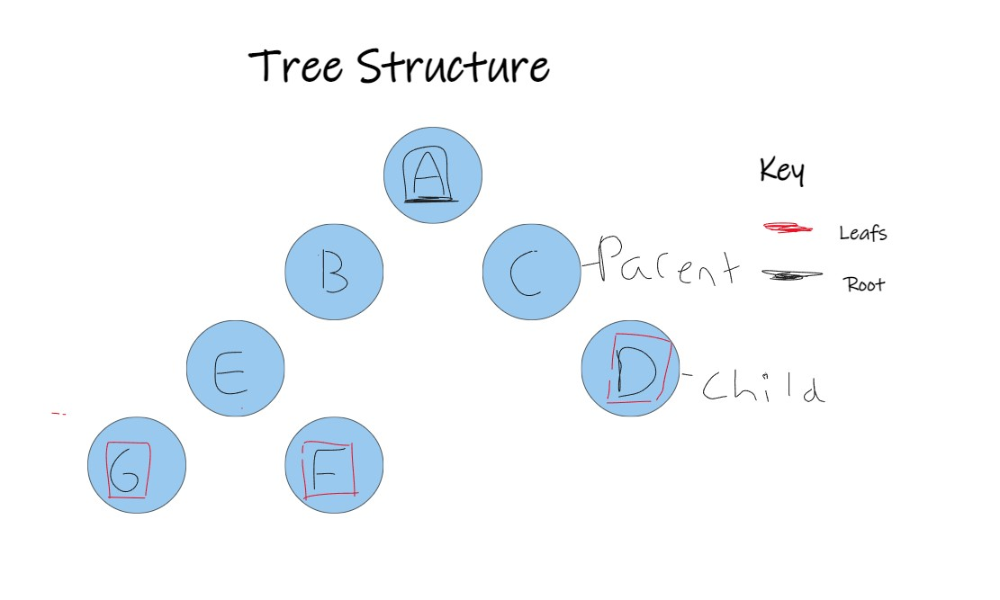

# Binary Trees
- Binary Tree is a special type of data structure. It is similar to a linked list. The start of the data structure  is the root( the top node). A node that is connected to two other nodes is called the parent, and the nodes connected to the parent are called the child. Nodes with no connections are called leaves. 
 

- Binary search tree Binary Search Tree: 
In a Binary search tree data is placed into the nodes in a specific manner.  Values of data less than a parent node are put on the left. Values greater are put on the right. Organizing data like this allows for fast iteration of the data.  Meaning you can look up, remove and insert data in a efficient manner. The operation time becomes O(log n) instead of O(n).

## Binary Tree Commands
## Example of Binary Trees
## Challange Problem 
