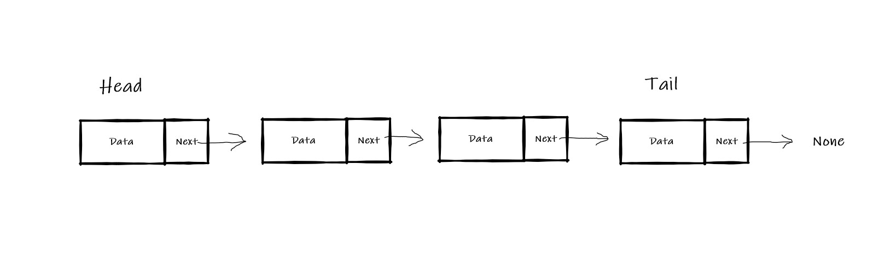
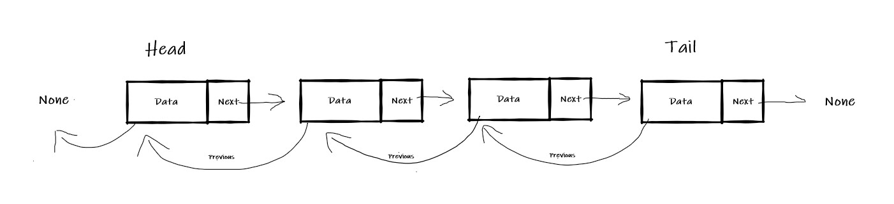

# Linked list
## What is a linked List. 
- A linked list is similar to a regular list. One of the main differences is how the data is stored. In a regular list a block of memory is allocated
to the list. When the list runs outs of memory it goes back to the memorya and allocates more. In a linked list there are many elemets. These elements are called nodes. 
Each node contains the data and pointers to where the next section of memory is.
## Diagram explaining Linked Lists

- linked list

- double linked list
- 

## linked list Commands
| Operation               | Description                    | Python Syntax               | Big O Performance |
| ------------------------| ------------------------------ | ----------------------------| ----------------- |
| insert_head(data)       |  Add value before head of stack| deque.appendleft(value)     | O(1)              |
| insert_tail(data)       | Add value after tail           | deque.append(value)         | O(1)              |
|insert(data)             | Adds value after node n        | deque.insert(n,value)       | O(n)              |
|remove_head()            |Removes the head of the list    | value = deque.pop()         | O(1)              |
|remove_tail()            |Removes the tail of the list    | value = deque.pop()         | O(1)              |
|remove(i)                |Removes node "i"                | del deque[i]                | O(n)              |
|size()                   |Return size of list             | length = len(deque)         | O(1)              |

## Example of a Linked List
Example of a linked list.
```python
class Linked_List:
    class Node:
        def __init__(self, data):
            self.data = data
            self.next = None
            self.prev = None
    def __init__(self):
        """
        Start a linked List
        """
        self.head = None
        self.tail = None

    def insert_head(self, value):
        """
        Insert a value at the start of a linked list
        """
        # new node
        new_node = Linked_List.Node(value)  
        if self.head is None:
            self.head = new_node
            self.tail = new_node
        else:
            new_node.next = self.head # Connect previous head to the new node
            self.head.prev = new_node # Connect the new node to the previoues head 
            self.head = new_node      # Update the head to point to the new node

    def insert_tail(self, value):
        """
        Insert a new node at the back of the 
        linked list.
        """
        new_node = Linked_List.Node(value)
        if self.tail == None:  #if tail equals head 
            self.tail = new_node
            self.head = new_node
        else:
            new_node.prev = self.tail 
            self.tail.next = new_node
            self.tail = new_node

    def remove_head(self):
        """ 
        Remove the first node of the linked list.
        """
        if self.head == self.tail:
            self.head = None
            self.tail = None
        elif self.head is not None:
            self.head.next.prev = None  # Disconnect the second node from the first node
            self.head = self.head.next  # Update the head to point to the second node

    def remove_tail(self):
        """
        Remove the last node
        """
        if self.head == self.tail:  
            self.head = None 
            self.tail = None
        elif self.tail is not None: 
            self.tail.prev.next = None
            self.tail = self.tail.prev

    def remove(self, value):
        """
        Remove node that contains a value
        """
        curr = self.head 
        while curr is not None:
            if curr.data == value:
                if curr == self.tail:  #tail condition
                    self.remove_tail()
                elif curr == self.head:  #head condition
                    self.remove_head()
                else:
                    curr.next.prev = curr.prev
                    curr.prev.next = curr.next
                    
                return
            curr = curr.next

    def replace(self, old_value, new_value):
        # replace a value with a new value
        curr = self.head
        while curr is not None:
            if curr.data == old_value:
                if curr == self.tail: 
                    self.insert_tail(new_value)
                    self.remove(old_value)

                if curr == self.head: 
                    self.insert_head(new_value)
                    self.remove(old_value)
                    
                else:
                    new_node = Linked_List.Node(new_value)
                    curr.prev.next = new_node
                    curr.next.prev = new_node
            curr = curr.next 
    def __iter__(self):
        """
        Iterate foward through the Linked List
        """
        curr = self.head  
        while curr is not None:
            yield curr.data 
            curr = curr.next # Go forward in the linked list

    def __reversed__(self):
        """
        Iterate backward through the Linked List
        """
        for item in reversed(list(self)): # go backward through the list.
            yield item
            

    def __str__(self):
        """
        Return a string representation of the linked list.
        """
        output = "linkedlist["
        first = True
        for value in self:
            if first:
                first = False
            else:
                output += ", "
            output += str(value)
        output += "]"
        return output
        #Special thanks to Aaron Kay. He helped me first understand these concepts. Some portions of this code are modeled after examples he gave to teach these concepts. 
```
## Challange Problem


