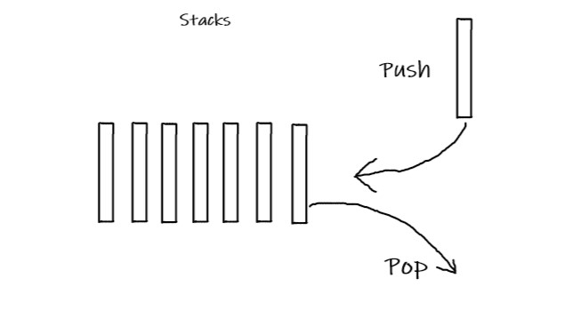

# Stacks

Data structures can seem boring, but when you understand what they do, and how they work they become incredibly useful.
A stack is a data structure that is reckonginzed in the order in which data is stored and removed. It is often called First in 
Last out. It can be created using a python list. 

A common use for stacks are in memory. For example in the Msp432 microcontroller the CPU pushes data in the registers to memory when the program calls a function. It does this to remember the data stored in those register when it needs return to that function. (This is to perserve the values like program counter)


## Pros and Cons
Pros
- Easily remove elements from stack
- Fast

Cons
- stack memory is limited
## Diagram 
A stack is often compared to a pile of plates. When you put plates away in the cupboard you stack them. When you go to grab a plate you will always grab the first one
put on to the stack. To put a plate(data) on a stack you use the PUSH command. To take a plate off of the stack you use a POP command. 
 
## Stack Commands
| Operation        | Description                    | Python Syntax               | Big O Performance |
| -----------------| ------------------------------ | ----------------------------| ----------------- |
| push(value)      |  Add value to stack            | stack_variable.append(value)| O(1)              |
| pop()            | Removes value from top of stack| variable = stack_variable.pop()|    O(1)        |
|size()            | Return size of stack.          | variable = len(stack_variable)| O(1)            |

## Stack Examples (tutorial)
``` python 
Websites = []       #creates the stack

website.append(address1)    # adds values(website addresses) to the stack
website.append(address2)
website.append(address3)

print(websites)              # will print [address1,address2,address2]

website.pop                   # removes the last item that you put on to the stack

print(websites)               #[address1,address2]
```

## Challenge Problem 

Create a stack to handle inputs on a keyboard. Each word will be an item on the stack. Create a stack for the phrase 
"She sells sea shells by the cea shore"

Oh on you missed spelled the word cea. it should be "sea"

pop the last 2 words in the list, and correct the spelling. 


